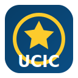

# UCIC Landing Page

<div align="center">
  
  <p align="center"><em>Official landing page for Universitas Catur Insan Cendekia</em></p>

  <a href="https://nextjs.org/">
    
  </a>
  <a href="https://react.dev/">
    
  </a>
  <a href="https://tailwindcss.com/">
    
  </a>
  <a href="https://eslint.org/">
    
  </a>
</div>

---

## Daftar Isi

- [Tentang Project](#tentang-project)
- [Fitur Utama](#fitur-utama)
- [Teknologi yang Digunakan](#teknologi-yang-digunakan)
- [Struktur Project](#struktur-project)
- [Cara Menjalankan](#cara-menjalankan)
- [Build & Deploy](#build--deploy)
- [Komponen & Fungsi](#komponen--fungsi)
- [Kontribusi](#kontribusi)

---

## Tentang Project

UCIC Landing Page adalah aplikasi web berbasis Next.js (Pages Router) yang menyajikan profil institusi, program studi, fasilitas, pengumuman, kolaborasi, dan lokasi kampus. Proyek ini mengutamakan performance, accessibility, maintainability, dan developer experience melalui arsitektur komponen yang terstruktur serta pengelolaan aset statis yang rapi.

---

## Fitur Utama

- Reusable component-based layout dengan navigasi yang jelas
- Multilingual support via React Context untuk state bahasa global.
- Section lengkap: Hero, Announcement, Page Information, About Us, Facility, Study Program, Collaboration, Map Section, dan Footer.
- Chatbot sederhana yang memanfaatkan API Gemini.
- Pengelolaan aset statis (images, PDF) di direktori public.
- Google Fonts via next/font (Inter, Albert Sans).
- Konfigurasi remote image domains pada Next.js.

---

## Teknologi yang Digunakan

- Next.js 15 (Pages Router) — React framework untuk SSR/SSG dan optimization pipeline.
- React 19 — modern UI library.
- Tailwind CSS v4 — utility-first CSS (via PostCSS).
- ESLint + eslint-config-next — code quality dan linting standar Next.js.
- lucide-react — icon set.
- react-fast-marquee — marquee/scrolling text effect.

Detail versi dan scripts tersedia di [package.json](package.json).

---

## Struktur Project

Struktur direktori inti:

```
ucic-landing-page/
├─ public/
│  ├─ img/
│  │  ├─ fasilitas/...
│  │  └─ ucic-logo.svg
│  └─ pdf/
│     └─ Biaya.pdf
├─ src/
│  ├─ components/
│  │  ├─ AboutUs.js
│  │  ├─ Announcement.js
│  │  ├─ Chatbot.js
│  │  ├─ Collaboration.js
│  │  ├─ Facility.js
│  │  ├─ Footer.js
│  │  ├─ Hero.js
│  │  ├─ MapSection.js
│  │  ├─ Navbar.js
│  │  ├─ PageInformation.js
│  │  └─ StudyProgram.js
│  ├─ context/
│  │  └─ LanguageContext.js
│  ├─ data/
│  │  └─ university-data.json
│  ├─ i18n/
│  │  └─ translations.js
│  ├─ pages/
│  │  ├─ _app.js
│  │  ├─ _document.js
│  │  ├─ index.js
│  │  └─ api/
│  │     ├─ chat.js
│  │     └─ hello.js
│  └─ styles/
│     └─ globals.css
├─ eslint.config.mjs
├─ jsconfig.json
├─ next.config.mjs
├─ package.json
├─ postcss.config.mjs
└─ README.md
```

Catatan:
- Konfigurasi domain gambar eksternal berada di [next.config.mjs](next.config.mjs).
- Font diinisialisasi melalui next/font pada [src/pages/_app.js](src/pages/_app.js).

---

## Cara Menjalankan

Prerequisites:
- Git
- Node.js 18.18+ (disarankan 20+) dan npm 10+
- Opsional: pnpm 9+ / yarn / bun

Verifikasi versi:
```bash
node -v
npm -v
```

1) Clone repository
```bash
git clone https://github.com/NicoIzumi30/uiuc-landing-page.git
cd uiuc-landing-page
```

2) Install dependencies
- Disarankan npm ci untuk instalasi yang reproducible (menghormati package-lock.json):
```bash
npm ci
```
- Alternatif:
```bash
# npm
npm install

# pnpm
pnpm install

# yarn
yarn install

# bun
bun install
```

3) Jalankan development server
```bash
npm run dev
```
Akses aplikasi pada:
- http://localhost:3000

Jika port 3000 sedang digunakan:
```bash
npm run dev -- -p 3001
```

4) Lint (opsional)
```bash
npm run lint
```

5) Build untuk production
```bash
npm run build
```

6) Menjalankan production server
```bash
npm start
```
Default: http://localhost:3000
Port kustom:
```bash
npm start -- -p 4000
```

7) Environment variables (opsional)
Buat file .env.local di root project jika diperlukan di masa depan:
```env
# contoh
NEXT_PUBLIC_API_BASE=https://api.example.com
```

8) Troubleshooting umum
- Bersihkan cache Next.js:
```bash
rm -rf .next
```
- Install ulang dependensi:
```bash
rm -rf node_modules package-lock.json
npm ci
```
- Pastikan Node.js LTS aktif (jika menggunakan nvm):
```bash
nvm install --lts
nvm use --lts
```


---

## Build & Deploy

Production build:

```bash
npm run build
npm start
```

Deployment yang direkomendasikan:
- Vercel
  - Import repository, pilih framework Next.js.
  - Gunakan build command dan output default Next.js.
  - Remote image domains telah disetel di [next.config.mjs](next.config.mjs).

Alternatif self-hosted:
- Jalankan `npm run build` kemudian `npm start` pada environment produksi (default port 3000).
- Pastikan environment variables (jika ditambahkan kemudian) sudah terkonfigurasi.

---

## Komponen & Fungsi

Halaman:
- [src/pages/index.js](src/pages/index.js): Entry landing page yang merangkai seluruh sections.
- [src/pages/_app.js](src/pages/_app.js): Global wrapper, LanguageProvider, font injection, dan Chatbot global.
- [src/pages/_document.js](src/pages/_document.js): Kustomisasi dokumen HTML dasar (SEO/aksesibilitas di root).

Komponen UI:
- [src/components/Navbar.js](src/components/Navbar.js): Main navigation.
- [src/components/Hero.js](src/components/Hero.js): Opening section dan value proposition.
- [src/components/Announcement.js](src/components/Announcement.js): Pengumuman/berita penting.
- [src/components/PageInformation.js](src/components/PageInformation.js): Ringkasan informasi halaman.
- [src/components/AboutUs.js](src/components/AboutUs.js): Profil institusi.
- [src/components/Facility.js](src/components/Facility.js): Fasilitas kampus dan media terkait.
- [src/components/StudyProgram.js](src/components/StudyProgram.js): Informasi program studi.
- [src/components/Collaboration.js](src/components/Collaboration.js): Partner/kolaborasi institusi.
- [src/components/MapSection.js](src/components/MapSection.js): Peta lokasi kampus.
- [src/components/Footer.js](src/components/Footer.js): Footer information dan links.
- [src/components/Chatbot.js](src/components/Chatbot.js): Komponen chatbot (rendered global via _app).

Context & Translations:
- [src/context/LanguageContext.js](src/context/LanguageContext.js): Global language state via React Context.
- [src/i18n/translations.js](src/i18n/translations.js): Sumber data translasi per bahasa.

Data & Assets:
- [src/data/university-data.json](src/data/university-data.json): Data statis pendukung tampilan.
- [public/pdf/Biaya.pdf](public/pdf/Biaya.pdf): Dokumen PDF informasi biaya.
- [public/](public/): Gambar dan berkas statis lainnya.

API Routes:
- [src/pages/api/chat.js](src/pages/api/chat.js): Endpoint sederhana untuk fitur chatbot.
- [src/pages/api/hello.js](src/pages/api/hello.js): Contoh endpoint bawaan Next.js.

Styles:
- [src/styles/globals.css](src/styles/globals.css): Global styles berbasis Tailwind CSS v4.

---


## Design System: Colors & Typography

Brand Colors
Sumber definisi tersedia pada [`src/styles/globals.css`](src/styles/globals.css:11).
- Primary: #073C64 (CSS var: --color-primary)
- Secondary: #fdcb2c (CSS var: --color-secondary)
- Primary Background: #083d62 (CSS var: --color-primary-bg)
- Secondary Background: #1a2c43 (CSS var: --color-secondary-bg)

Contoh penggunaan (Tailwind CSS v4 tokens):
```jsx
<div className="text-primary bg-secondary-bg border-secondary">
  {/* content */}
</div>
<div className="bg-gradient-to-br from-primary to-[#1a2c43]" />
```

Typography
Sumber konfigurasi font:
- Root font stack di [`src/styles/globals.css`](src/styles/globals.css:3)
  - --font-inter: "Inter", Helvetica, sans-serif
  - --font-albert-sans: "Albert Sans", Helvetica, sans-serif
- Default body font: var(--font-albert-sans) di [`src/styles/globals.css`](src/styles/globals.css:33)
- Utility classes:
  - .font-inter di [`src/styles/globals.css`](src/styles/globals.css:49)
  - .font-albert-sans di [`src/styles/globals.css`](src/styles/globals.css:53)
- next/font setup di [`src/pages/_app.js`](src/pages/_app.js:1) untuk Inter dan Albert Sans (dengan CSS variables --font-inter dan --font-albert-sans).
- Preconnect dan stylesheet Albert Sans di [`src/pages/_document.js`](src/pages/_document.js:7)

Contoh penggunaan:
```jsx
// Menggunakan default body: Albert Sans (sudah diterapkan di globals.css)

<h1 className="font-inter text-3xl text-primary">Judul Menggunakan Inter</h1>
<p className="font-albert-sans text-brand-base text-gray-700">
  Paragraf menggunakan Albert Sans
</p>
```


## Kontribusi

Panduan kontribusi:
1. Fork repository dan buat branch: `feature/nama-fitur` atau `fix/nama-perbaikan`.
2. Ikuti standar kode dan linting:
```bash
npm run lint
```
3. Tulis deskripsi Pull Request yang jelas (apa yang diubah, alasan, dampak).
4. Sertakan tangkapan layar atau langkah uji jika relevan.
5. Tunggu review, lakukan perbaikan jika diminta, kemudian merge.

Konvensi commit (disarankan): gunakan prefix `feat:`, `fix:`, `docs:`, `refactor:`, `test:`, `chore:` untuk menjaga konsistensi riwayat perubahan.
